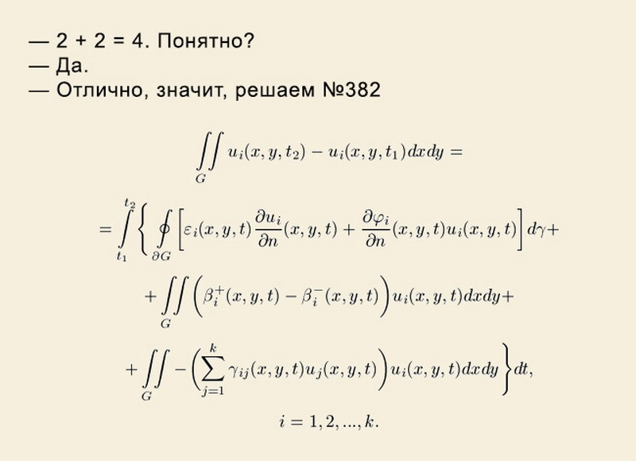

# Intspirit DEV course

### Цель курса: 
1. Знакомство с теорией разработки ПО
2. JavaScript - от основ к глубокому пониманию
3. Изучение современных технологий разработки серверной и клиентской части web-приложений
4. Приглашение лучших "студентов" в штат.

Помимо знакомства с новыми технологиями, научить людей мыслить, искать решения поставленных задач самостоятельно. Поэтому в ходе курса необходимо уделить довольно много времени самостоятельным изысканиям, поиску информации, отработке различных туториалов, домашних заданий. Самостоятельная работа - повседневная работа программиста!

### Для каждого занятия обговорить:
1. Причины изучения той или иной темы
2. Цели, которые должны быть достигнуты
3. Выводы по окончанию занятия
4. Без практики все это всего лишь справочная информация

**Иначе занятие будет бесполезным!**

### Материалы для постоянного самостоятельного изучения: 
https://www.youtube.com/c/VladilenMinin/videos

https://learn.javascript.ru  (выполнять все предложенные задания)

https://css-tricks.com/guides

### Требования к тех-обеспечению процесса:
1. Отдельный класс
2. 1 человек - 1 компьютер с OS Ubuntu, 1-2 монитора (железки не древние)
3. предустановлен python
4. Рабочее место “преподавателя”: стол, компьютер, доска и маркеры, телевизор для вывода крупных изображений с компьютера преподавателя
5. Slack/Skype канал
6. Группа не более 5-6 человек

### Предварительный итог:
**38 занятий**

Из них

  2 занятия React (опционально)
  
  2 занятия GraphQL/Serverless (опционально)
	
  2 занятия CI/CD Kubernetes (опционально)

**3 занятия в неделю => срок обучения (при условии, что группа "движется" одинаково) 3 мес + 2 занятия**

**Если выкинуть “опциональные”, то срок обучения 2 мес + 2 недели**
